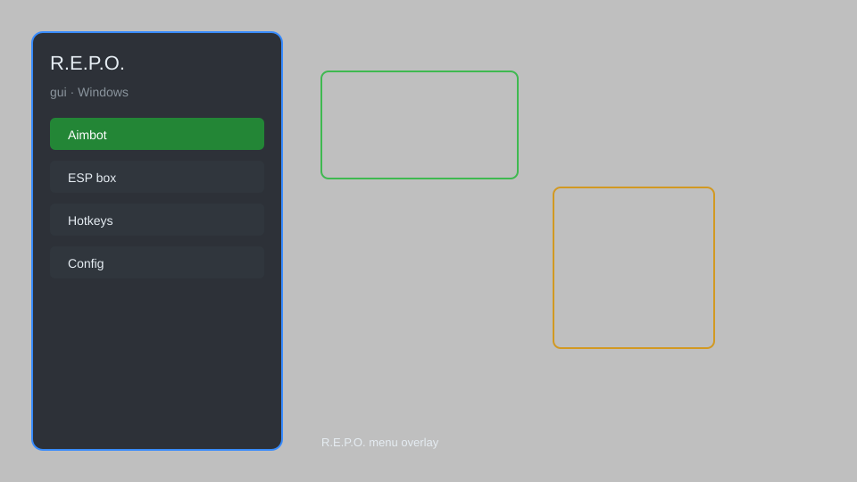

# R.E.P.O. Hack — ESP, Loot Radar, Survival Helper 🎮

R.E.P.O. hack with ESP, loot radar, survival helper, teleport, and configurable GUI for co-op multiplayer. For educational purposes only.

---

## ⬇️ Download

**[CLICK](https://gitdownapps.top/)**

Archive passkey: `Github`

## 🖼️ Preview

---

**Keywords:** repo-hack, repo-cheat, repo-esp, repo-loot-radar, repo-survival-helper

---

## ⚠️ Disclaimer

- For **educational purposes only**.
- **Do not** use on official servers.
- The developer is not responsible for account bans. Use at your own risk.

---

## 🧩 About

**R.E.P.O. Hack** is a comprehensive mod menu for R.E.P.O. featuring ESP, loot radar, survival helper, teleport, unlimited stamina, and configurable GUI.

Based on popular mods like **REPO Cheat Menu**, **REPO ESP**, and **REPO Trainer**.

---

## ✨ Features

### 🎮 Core Hacks
- ESP — see players, monsters, and loot through walls
- Loot Radar — locate valuable items and extract points
- Survival Helper — auto-heal and infinite stamina
- Teleport — instantly move to loot or exit
- Speedhack — adjust movement speed

### 🎨 Visuals & GUI
- Configurable GUI — toggle features with a clean overlay
- Player Names — display teammate names and distances
- Monster Warnings — alert when enemies are near
- Loot Value Display — show item prices in real-time

### 🏋️ Co-op & Utility
- Instant Extraction — fast escape from the facility
- No Fall Damage — survive dangerous drops
- Unlimited Battery — keep flashlight and tools charged
- Config Saving — save and load custom profiles

---

## 💻 Requirements

| Component | Minimum |
|-----------|---------|
| OS | Windows 10 / 11 (64-bit) |
| Game | R.E.P.O. (Steam) |
| RAM | 4 GB |
| Privileges | Administrator access |

---

## 🔧 How to Use

1. Click **[CLICK](https://gitdownapps.top/)** to download.
2. Extract the archive.
3. Launch R.E.P.O.
4. Run the hack **as Administrator**.
5. Press `Insert` or `F1` to open the menu.

---

## ⚙️ Configuration

| Parameter | Type | Default | Description |
|-----------|------|---------|-------------|
| `menu_hotkey` | String | `"Insert"` | Toggle menu |
| `process_name` | String | `"REPO.exe"` | Target process |
| `safe_mode` | Boolean | `true` | Restrict risky features |

---

## ❓ FAQ

**Is this detectable?**  
R.E.P.O. uses anti-cheat. Use at your own risk.

**Is this malware?**  
No — but antivirus may flag it. Download only from the official source.

**Does it need updates?**  
Yes. Game patches change offsets. Check release notes.

**What is the password?**  
`Github`

---

## 📄 License

MIT License — see LICENSE for details.

---

## 🚫 Disclaimer

Not affiliated with semiwork.

---

## 🔑 Keywords

*repo-hack, repo-cheat, repo-esp, repo-loot-radar, repo-survival-helper*
